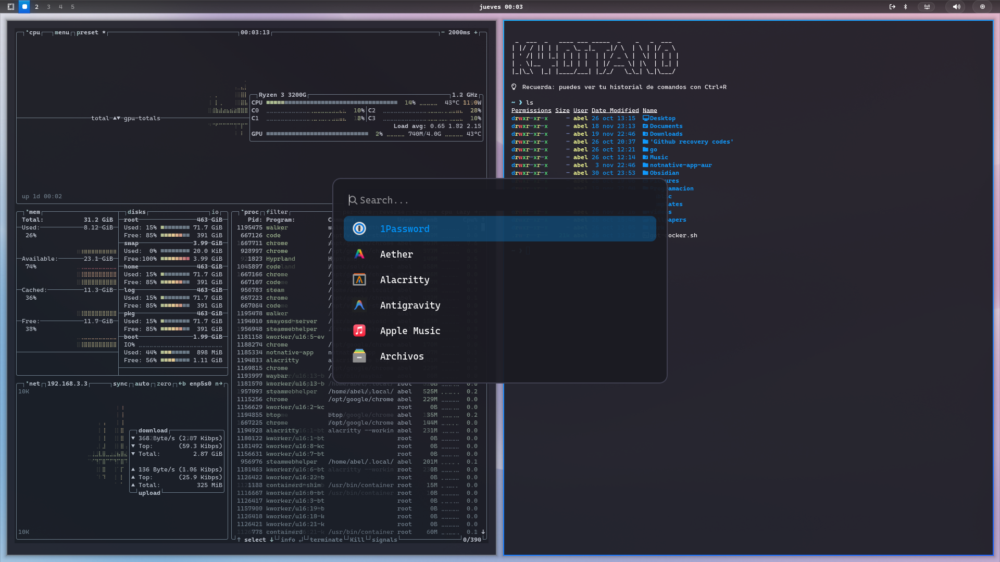

# Liquid Bl4ck

A sleek, minimalist theme for Omarchy (Hyprland) inspired by Apple's Liquid Crystal aesthetic with a dark, modern approach.

## Preview


## Installation

### Recommended Method (Bash)
You can install this theme directly using the `omarchy-theme-install` command if you have Omarchy installed:

```bash
omarchy-theme-install https://github.com/k4ditano/liquidbl4ck.git
```

### Manual Installation
Copy the configuration files to their respective locations in `~/.config/`.

- `hyprland.conf` -> `~/.config/omarchy/current/hyprland.conf`
- `waybar.css` -> `~/.config/omarchy/current/waybar.css`
- `walker.css` -> `~/.config/omarchy/current/walker.css`
- And all other configuration files

## Features

- **Hyprland:** Rounded borders (16px), optimized blur, soft shadows and fluid animations
- **Waybar:** Dark crystal glass-style bar with gradients and depth effects
- **Walker:** Launcher with rounded borders and subtle hover effects
- **Terminal:** Themes for Alacritty, Kitty and Ghostty with dark color scheme
- **Colors:** Dark base (#1a1a22), white text (#ffffff), blue accent (#0096ff)

## Requirements

- Omarchy
- Hyprland
- Waybar
- Walker
- Terminal: Alacritty / Kitty / Ghostty
- Fonts: SF Pro Display (recommended) or Roboto

## Credits

Theme created by [k4ditano](https://github.com/k4ditano)
